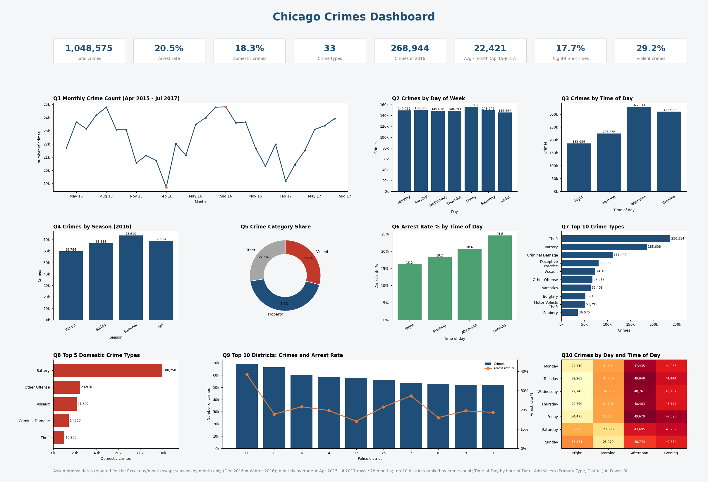

# Chicago Crimes Dashboard

Interactive single-page Streamlit dashboard for the Chicago Crimes Dashboard Competition:
8 KPI cards, 10 visuals (Q1-Q10) and sidebar filters (Primary Type, District, Crime Category, Year, Arrest, Domestic).



## Run it
```bash
pip install -r requirements.txt
streamlit run app.py
```
The app reads `analysis_output/crimes_clean.csv.gz` (already included).

## Rebuild the cleaned data (optional)
You must supply the original Excel file yourself (it is not in this repo, 150 MB):
```bash
python crime_analysis.py Crime_Dataset.xlsx
```
This also prints all KPIs, writes the charts, `results/insights.txt` and a static `dashboard.png`.

## Data note
The Excel file stored many dates with day and month swapped (Excel read 03/01/2023 as 3 Jan).
`crime_analysis.py` detects and repairs this. After repair, monthly crimes range 18,710-24,818,
matching the competition handout.

## Assumptions
- Seasons are assigned by month only (Dec 2016 = Winter 2016).
- Average per month = rows in Apr 2015-Jul 2017 / 28 months.
- Time of Day by hour: Night 00-05, Morning 06-11, Afternoon 12-17, Evening 18-23.
- Top-10 districts are ranked by crime count.

Data: City of Chicago crimes dataset.
